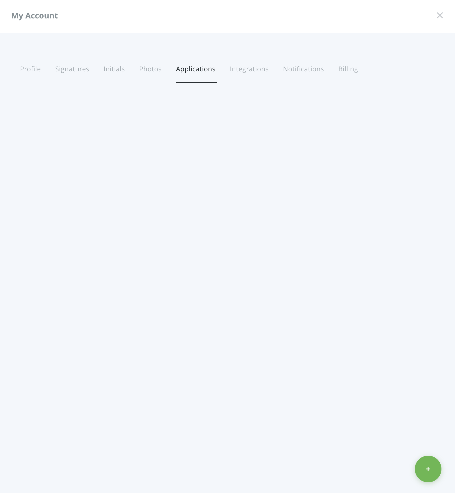
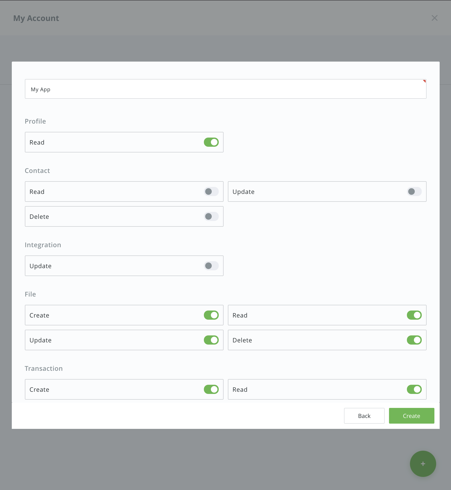
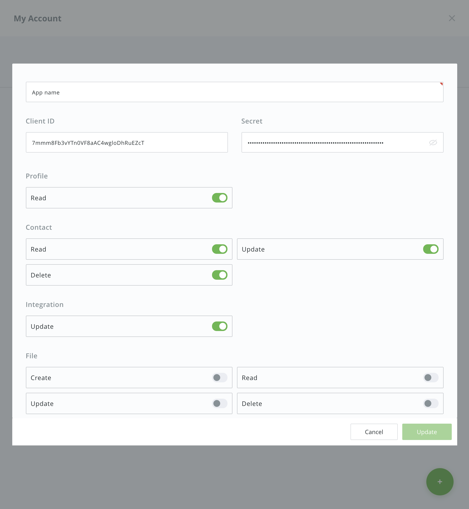

# Create an App in Hancock

1. Sign In into Hancock [https://hancock.ink](https://hancock.ink)
2. Visit [https://hancock.ink/applications]https://hancock.ink/applications)

3. Create an app, enter the **name** and configure **permisssions** you need for this app.

4. On the created app you have Client ID and Secret, this is your credentials to obtain a token to perform an authorized API requests.
